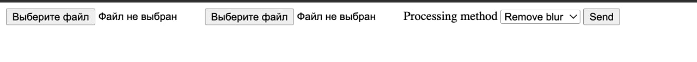
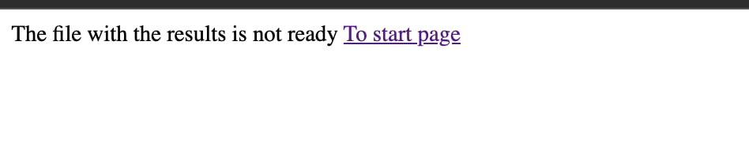

# Images handler

### Опис функціоналу



#### 1) Стартова сторінка. перший файл - це обовʼязково zip (з фотками). другий файл - це файл з конфігураціями. селект-філд - це тестове поле для вибору методу обробки


#### 2) Після відправки запиту на обробку віддається URL, по якому потім можна буде отримати результати, коли вони будуть готові



#### 3) Таке показує, якщо по урлу результати ще не готові. якщо результати будуть готові, то просто відбудеться автоматичне скачування zip-файлу з результатами


### Принцип роботи

Коли файли завантажуюься, то автоматично в папці ```data``` створюється нова папка під цей новий запит (назва папки зроблена з дати та часу запиту ```strftime```). В цю папку завантажуються файли, що прийшли у запиті. Результати потім будуть завантажуватись в ту ж папку з назвою ```results.zip```. Якщо цей файл є, то і по урлу віддадуться результати обробки зображень